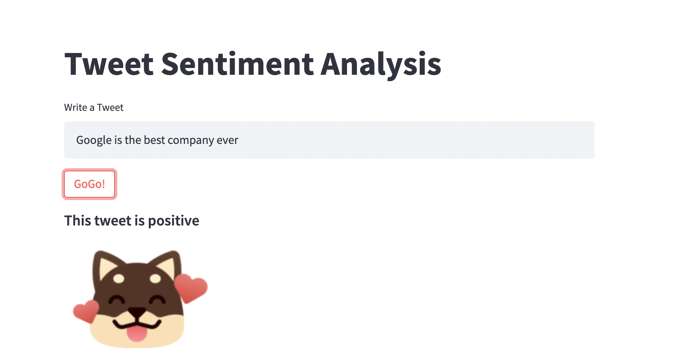

# Sentiment Analysis of Tweets by Brand
#### Authors: Eddie Prado, Sally Heinzel, Valeria Viscarra Fossati, and Weston Shuken


###### Image by SurveySensum

## Overview
Understanding brand and product reputation is difficult when only provided with customer surveys and review data. However, there is an abundance of social media responses to products and brands on various platforms. With these unofficial reviews and preferences towards products via tweets from Twitter, we can derive an overall sentiment towards your brand and products.

Our comany, ViaGoGo, can provide you with a state-of-the-art machine learning model that rates the product and brand sentiment based on users who tweet about your brand. We can provide you with real-time graphs showing the trends of user sentiment towards your brand and products.

## Business Issue

Companies have little insight into their overall brand reputation on social media platforms. Twitter can provide real-time, accurate analysis of brand reputation based on the sentiment analysis of tweets on Twitter. The word cloud below is an example of how Twitter users are talking about Google and Apple:


Our team of experts has built a Machine Learning model that uses Natural Language Processing to distinguish between positive and negative sentiment in Tweets. Using Google and Apple mentions on Twitter, we were able to classify sentiment to an 72% accuracy. 

This model will be used as an analytics tool for companies to access their products' popularity on Twitter without having to access Twitter API. 

## Data & Methods
The dataset comes from Crowdflower via [data.world](https://data.world/crowdflower/brands-and-product-emotions) *Created: August 30, 2013 by Kent Cavender-Bares*. The data contains over 9,000 tweets from Twitter users that evaluated multiple brands and products. The crowd was asked if the tweet expressed positive, negative, or no emotion towards a brand and/or product. If some emotion was expressed, they were also asked to say which brand or product was the target of that emotion. 

During our exploratory data analysis, we found that the data was not balanced, as shown by the graphs below:

#### All data sentiment count:


#### Google & Apple sentiment ratio:


In order to address this imbalance, we first used a binary classifier to predict if a tweet would have a negative or not negative response, but due to the nature of our data we instead decided to go with a multiclass classifier to label our neutral tweets.

## Results & Evaluation

We built multiclass models to predict whether tweets were positive, neutral and negative. Our baseline model has a 61%  accuracy which is derived by always predicting the neutral class (given its imbalance). We increased this score using machine learning models, specifically Naive Bayes, Random Forest, Neural Network, and SGD Classifier, finally arriving at our best model at ~72% accuracy.


## Online Application

We created an online application to demo the model's performance. The user can input a sample tweet and click the 'GoGo!' button, which will then return a sentiment score for the sample tweet of Positive, Negative, or Neutral.

 


## Business Proposal Summary
Being competitive in the 21st century means utilizing 21st-century tools. ViaGogo’s Twitter Sentiment Analysis, built using natural language processing, offers Twitter an opportunity to give their brand users an advantage in the marketplace. This product enables businesses to capture public reactions about their company and products in a far more timely and authentic manner than focus groups or surveys. It collects and analyzes real-time reactions in order for businesses to make effective decisions.

The Twitter Sentiment Analysis adds value to businesses in 3 main ways:
-	Brand Perception – track what people are saying about a company/product in real-time within a mercurial social media environment;
-	Market Research – identify and explore the sentiments directed at one’s competitors in order to develop strategies based on their successes and struggles;
-	Customer Service – pinpoint which brands, locations, or services are thriving in customer satisfaction and which ones need the most urgent attention.

By adopting ViaGogo’s Twitter Sentiment Analysis and offering it as a service for corporate users, Twitter will increase its utility and make itself an indispensable part of the modern business landscape.

## Next Steps
ViaGogo in currently working on some new applications for its Twitter Sentiment Analysis. One product in development is the Positivity Rater. This tool gives users a positivity rating based on the analysis of the account’s past tweets. This can be useful to increase engagement among Twitters users. With so many people turned off by negative and harmful content, the Positivity Rater allows an individual to gauge how positive someone is when considering whether or not to follow them. We believe this will boost user activity and retain those who otherwise may stop using Twitter due to so much unwanted, pernicious content.

Another area ViaGoGo is actively working on is the creation of dashboards, which allow users to easily visualize sentiment analysis both in real-time and longitudinally. These dashboards will filter data on different dimensions, such as time frame, location, and product/service. It will also facilitate easy comparison of a given metric (for example, comparing the sentiments expressed towards 2 different branches or how sentiment about a product compares to this time last year).

Finally, ViaGoGo is already in production of a web app that allows users to write a tweet and see its sentiment rating before publishing it. This will ensure that the author strikes the appropriate tone with their tweet and can prevent thoughtless or poorly constructed tweets from entering the public domain. This feature will be valued by social media managers sitewide.

---

<h2><center>Brought to you by</h2></center>

<p align="center">

</p>


---

#### For more information
Please contact the contributors to this analysis: 
[Eddie Prado](https://www.linkedin.com/in/edel-prado-jr/) |
[Sally Heinzel]() |
[Valeria Viscarra Fossati](https://www.linkedin.com/in/valeria-vf/) |
[Weston Shuken](https://www.linkedin.com/in/westonshuken/)


**Repository Structure:**
```
├── data                                   <- Both sourced externally and generated from code 
├── images                                 <- Both sourced externally and generated from code 
├── .gitignore                             <- gitignore      
├── README.md                              <- The top-level README for reviewers of this project
├── ViaGoGo_presentation.pdf               <- PDF version of project presentation
├── app.py                                 <- ViaGoGo streamlit application back-end
└── index.ipynb                            <- Narrative documentation of analysis and modeling

```
